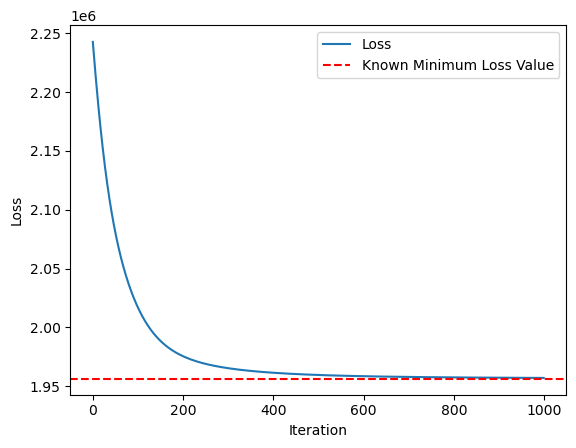
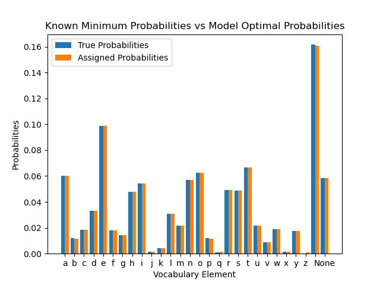

|    | Characters   |   Actual Probabilities |   Assigned Probabilities |   Difference |
|---:|:-------------|-----------------------:|-------------------------:|-------------:|
|  0 | a            |            0.0600961   |              0.060044    |  5.21021e-05 |
|  1 | b            |            0.0117946   |              0.011733    |  6.15641e-05 |
|  2 | c            |            0.0184883   |              0.0184533   |  3.49999e-05 |
|  3 | d            |            0.0331683   |              0.033166    |  2.27425e-06 |
|  4 | e            |            0.09897     |              0.0987262   |  0.000243836 |
|  5 | f            |            0.0181673   |              0.0181312   |  3.60624e-05 |
|  6 | g            |            0.0141927   |              0.0141419   |  5.078e-05   |
|  7 | h            |            0.047939    |              0.0479213   |  1.76715e-05 |
|  8 | i            |            0.0542687   |              0.0542348   |  3.38355e-05 |
|  9 | j            |            0.00140857  |              0.00169563  | -0.000287062 |
| 10 | k            |            0.00413062  |              0.00401792  |  0.000112698 |
| 11 | l            |            0.0306498   |              0.030644    |  5.76544e-06 |
| 12 | m            |            0.0217185   |              0.0216932   |  2.5219e-05  |
| 13 | n            |            0.0571215   |              0.0570791   |  4.23992e-05 |
| 14 | o            |            0.0624274   |              0.0623672   |  6.02236e-05 |
| 15 | p            |            0.0118064   |              0.0117449   |  6.15038e-05 |
| 16 | q            |            0.000897445 |              0.0013843   | -0.000486855 |
| 17 | r            |            0.0493981   |              0.0493771   |  2.1008e-05  |
| 18 | s            |            0.0486938   |              0.0486744   |  1.93713e-05 |
| 19 | t            |            0.0668552   |              0.0667783   |  7.68973e-05 |
| 20 | u            |            0.021867    |              0.0218422   |  2.48077e-05 |
| 21 | v            |            0.00869065  |              0.00861092  |  7.97329e-05 |
| 22 | w            |            0.0188032   |              0.0187693   |  3.39788e-05 |
| 23 | x            |            0.0012481   |              0.00159273  | -0.000344629 |
| 24 | y            |            0.0173516   |              0.0173128   |  3.88334e-05 |
| 25 | z            |            0.000102523 |              0.000993769 | -0.000891246 |
| 26 |              |            0.161536    |              0.160707    |  0.000828465 |
| 27 | None         |            0.0582091   |              0.0581632   |  4.58484e-05 |

